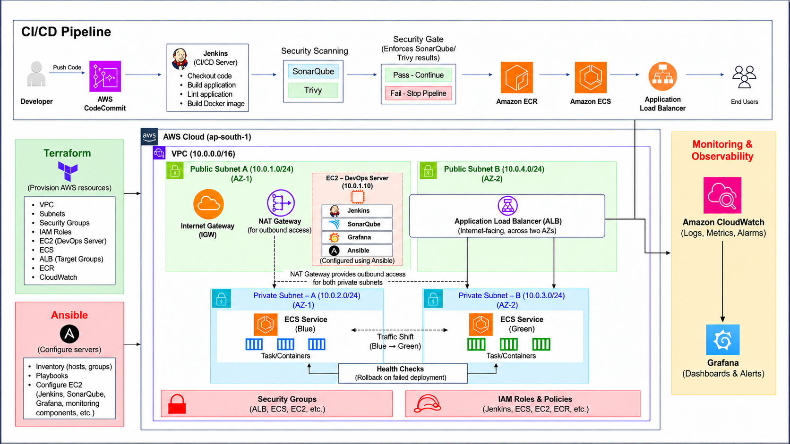

# Automated Application Delivery on AWS
### Using Jenkins, Terraform, Ansible, and ECS

> 📄 **Full project documentation:** [`Capstone_Project.pdf`](./Capstone_Project.pdf)

---

## Overview

This project implements a fully automated CI/CD pipeline that builds, scans, and deploys a containerized React + Vite web application on AWS. Terraform provisions the infrastructure, Ansible configures the DevOps server, and Jenkins orchestrates the entire delivery workflow — from code checkout to Blue/Green deployment on Amazon ECS.

---

## Architecture



> The diagram above shows the full CI/CD pipeline, AWS infrastructure, Blue/Green ECS deployment, and monitoring setup.

**Key layers:**
- **CI/CD Pipeline** — Jenkins (on EC2) pulls from CodeCommit, builds the app, runs SonarQube analysis, scans with Trivy, and pushes validated images to ECR.
- **Infrastructure** — VPC with 2 public and 2 private subnets across two AZs, Internet Gateway, NAT Gateway, ALB, ECS (Fargate), ECR, and CloudWatch — all provisioned via Terraform.
- **Deployment** — Blue/Green strategy using two ECS services and separate ALB target groups.
- **Monitoring** — CloudWatch for logs/metrics/alarms; Grafana dashboards backed by CloudWatch.

---

## Technology Stack

| Layer | Tools |
|---|---|
| Infrastructure Provisioning | Terraform |
| Server Configuration | Ansible |
| Source Control | Git, AWS CodeCommit |
| CI/CD | Jenkins |
| Containerization | Docker |
| Image Registry | Amazon ECR |
| Container Deployment | Amazon ECS (Fargate) |
| Traffic Management | Application Load Balancer |
| Code Quality | SonarQube |
| Vulnerability Scanning | Trivy |
| Monitoring | Amazon CloudWatch, Grafana |
| Networking | Amazon VPC, Internet Gateway, NAT Gateway |
| Access Management | AWS IAM |

---

## Project Structure

```
.
├── Capstone_Project.pdf          # Full project documentation
├── architecture-diagram.png      # Architecture diagram
├── Quiz-App/                     # React + Vite application source
│   ├── Dockerfile
│   ├── Jenkinsfile
│   ├── package.json
│   ├── public/
│   └── src/
├── Terraform/                    # AWS infrastructure as code
│   ├── provider.tf
│   ├── variables.tf
│   ├── vpc.tf
│   ├── subnets.tf
│   ├── route_tables.tf
│   ├── security_groups.tf
│   ├── iam.tf
│   ├── ec2.tf
│   ├── ecr.tf
│   ├── ecs.tf
│   ├── alb.tf
│   └── outputs.tf
├── Ansible/                      # Server configuration
│   ├── inventory.ini
│   └── devops_setup.yml
└── ECS/
    └── ecs-task-definition.json
```

---

## Prerequisites

- AWS account with permissions to create the required resources
- AWS CLI installed and configured
- Terraform, Ansible, Docker, and Git installed locally
- An EC2 key pair named `capstone-key` created in AWS

---

## Implementation Steps

### Step 1 — Containerize the Application

The Quiz App uses a multi-stage Dockerfile: Node 22 Alpine builds the Vite production bundle; Nginx Alpine serves the static files.

```dockerfile
FROM node:22-alpine AS builder
WORKDIR /app
COPY package*.json ./
RUN npm ci
COPY . .
RUN npm run build

FROM nginx:alpine
COPY --from=builder /app/dist /usr/share/nginx/html
EXPOSE 80
CMD ["nginx", "-g", "daemon off;"]
```

### Step 2 — Provision Infrastructure with Terraform

Creates a VPC (`10.0.0.0/16`) with two public subnets (for ALB, EC2, NAT Gateway) and two private subnets (for ECS workloads), along with security groups, IAM roles, ECR, ECS cluster, and ALB.

```bash
terraform init
terraform validate
terraform plan
terraform apply
```

### Step 3 — Configure the DevOps Server with Ansible

The Ansible playbook configures the EC2 DevOps server with: Docker, Node.js, AWS CLI, Trivy, Jenkins, SonarQube (Docker), and Grafana (Docker).

```bash
# Verify connectivity
ansible -i inventory.ini devops_server -m ping

# Run the playbook
ansible-playbook -i inventory.ini devops_setup.yml
```

Access the tools via the EC2 public IP:
- **Jenkins** → `http://<EC2_IP>:8080`
- **SonarQube** → `http://<EC2_IP>:9000`
- **Grafana** → `http://<EC2_IP>:3000`

### Step 4 — Jenkins CI/CD Pipeline

The Jenkinsfile defines the full pipeline:

| Stage | What it does |
|---|---|
| Checkout | Pulls source code from AWS CodeCommit |
| Install Dependencies | `npm ci` |
| Lint | `npm run lint` |
| Build Application | `npm run build` |
| SonarQube Analysis | Static code and security analysis |
| Build Docker Image | Tags image with Jenkins build number |
| Trivy Scan | Fails pipeline on HIGH/CRITICAL vulnerabilities |
| Security Gate | Waits for SonarQube quality gate result |
| Login to ECR | Authenticates with Amazon ECR |
| Push to ECR | Pushes validated image |

### Step 5 — Blue/Green Deployment to Amazon ECS

Two ECS services (`quiz-app-blue` and `quiz-app-green`) run in private subnets, each connected to its own ALB target group. Traffic is shifted by updating the ALB listener.

**Deploy new version:**
```bash
# Update Green service with new image
aws ecs update-service --cluster capstone-cluster \
  --service quiz-app-green --task-definition quiz-app \
  --region <AWS_REGION>

# After health checks pass, shift traffic to Green
aws elbv2 modify-listener --listener-arn <LISTENER_ARN> \
  --default-actions Type=forward,TargetGroupArn=<GREEN_TG_ARN> \
  --region <AWS_REGION>
```

**Rollback** by pointing the listener back to the Blue target group.

### Step 6 — Monitoring with CloudWatch and Grafana

CloudWatch collects ECS logs (`/ecs/quiz-app`), CPU/memory utilization, and ALB metrics. Grafana is configured with CloudWatch as a data source and provides dashboards for:

- ECS CPU and Memory Utilization (Blue & Green)
- ALB Request Count and Target Response Time
- Healthy / Unhealthy Host Count

---

## Deployment Verification

Once deployed, access the application via the ALB DNS name:

```
http://<ALB_DNS_NAME>
```

---

## Security Highlights

- SSH access to the DevOps EC2 server is restricted to a specific administrator IP.
- SonarQube quality gate and Trivy vulnerability scan act as security gates — the pipeline stops if either fails.
- ECS tasks run in private subnets with no public IP; outbound access is through the NAT Gateway.
- Jenkins accesses AWS via an IAM instance profile (no hardcoded credentials).
- Grafana reads CloudWatch metrics via the EC2 IAM role — no AWS keys stored on the server.
