# Automated Application Delivery on AWS with Jenkins, Terraform, Ansible & ECS

An end-to-end DevOps pipeline that builds, scans, containerizes and deploys a React + Vite **Quiz App** to **Amazon ECS (Fargate)** using **Blue/Green deployment**, with infrastructure provisioned by **Terraform**, servers configured by **Ansible**, and monitoring/alerting through **CloudWatch + Grafana**.

> 📄 **Full project documentation:** [`Capstone_Project.pdf`](./doc/Capstone_Project.pdf)

## Architecture Diagram
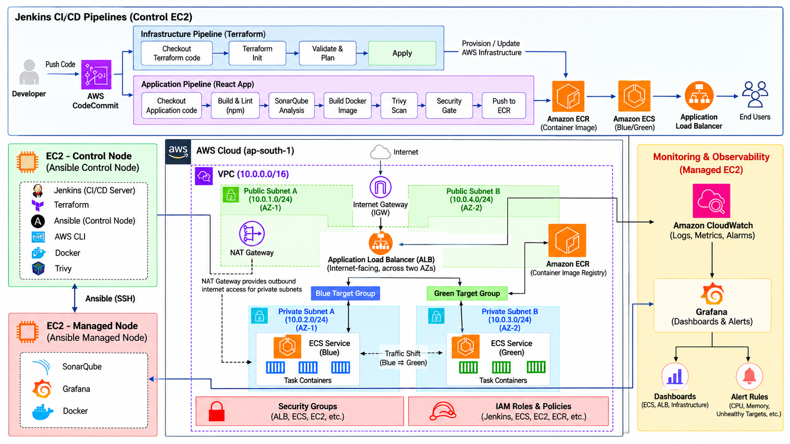

## Highlights

- **Infrastructure as Code**: VPC, subnets, NAT/IGW, IAM, ECR, ECS, ALB and EC2 provisioned by Terraform through a Jenkins infrastructure pipeline.
- **Configuration management**: Ansible installs Docker and deploys SonarQube and Grafana on a dedicated managed EC2.
- **Secure CI/CD**: lint, build, SonarQube quality gate and Trivy scan (fails on HIGH/CRITICAL) before anything reaches ECR.
- **Blue/Green releases**: new version goes to the Green ECS service, is health-checked, then the ALB listener is switched. Rollback is a listener flip back to Blue.
- **Observability**: CloudWatch logs/metrics, Grafana dashboards, and alert rules tested by deliberately triggering and clearing them.
- **No long-lived AWS keys**: Jenkins and Grafana use EC2 IAM roles.

## Tech Stack

| Area | Tools |
|---|---|
| Infrastructure | Terraform, Amazon VPC, IGW, NAT Gateway, IAM |
| Configuration | Ansible |
| CI/CD | Jenkins, Git / AWS CodeCommit |
| Containers | Docker (multi-stage, Nginx), Amazon ECR, Amazon ECS Fargate |
| Traffic | Application Load Balancer (Blue/Green target groups) |
| Security & quality | SonarQube, Trivy |
| Monitoring | Amazon CloudWatch, Grafana |

## Architecture Overview

The platform is split into three layers: **network and infrastructure**, **delivery tooling**, and **runtime**.

**Network and infrastructure**
- One VPC with **2 public + 2 private subnets** across two Availability Zones, so the ALB and the application survive the loss of a single AZ.
- **Public subnets** hold the internet-facing ALB, the NAT Gateway and the Managed EC2, and route to the Internet Gateway.
- **Private subnets** hold the ECS Fargate tasks. They have no public IPs and accept HTTP only from the ALB security group. Outbound traffic (for example, pulling images from ECR) goes out through the NAT Gateway.

**Delivery tooling (two EC2 instances)**
- **Control EC2** (bootstrap, created manually): runs Jenkins, Terraform, Ansible, AWS CLI, Docker and Trivy. It is created by hand because Jenkins must exist before it can run the Terraform pipeline. Everything else is created by that pipeline.
- **Managed EC2** (Terraform-provisioned, Ansible-configured): hosts **SonarQube** (`:9000`) and **Grafana** (`:3000`) as Docker containers. Ansible reaches it over SSH from the Control EC2.
- Jenkins and Grafana authenticate to AWS with **EC2 IAM roles**, so no access keys are stored anywhere.

**Runtime (Blue/Green on ECS)**
- Two ECS services, **Blue** and **Green**, each registered with its own ALB target group.
- The ALB listener's default action decides which one receives user traffic. A release deploys to the idle service, is health-checked, and only then does the listener switch. Switching back is the rollback.
- Container logs go to CloudWatch (`/ecs/capstone`), and Grafana reads CloudWatch metrics for dashboards and alerts.

## Pipelines

### 1. Infrastructure pipeline (`Jenkinsfile-infrastructure`)

Runs Terraform from the `terraform/` directory. The apply stage waits for a manual approval so the plan can be reviewed first.

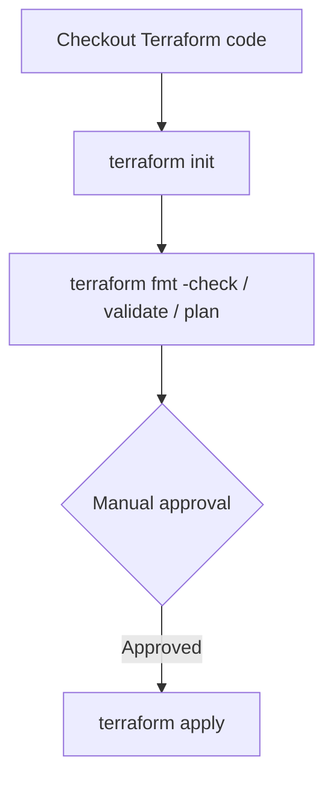
```mermaid
flowchart TD
    A[Checkout Terraform code] --> B[terraform init]
    B --> C[terraform fmt -check / validate / plan]
    C --> D{Manual approval}
    D -->|Approved| E[terraform apply]
```

### 2. Application pipeline (`Jenkinsfile`)

Every stage must pass before the next one runs. A failed quality gate or a HIGH/CRITICAL vulnerability stops the pipeline before anything reaches ECR.

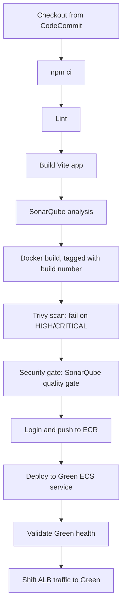
```mermaid
flowchart TD
    A[Checkout from CodeCommit] --> B[npm ci]
    B --> C[Lint]
    C --> D[Build Vite app]
    D --> E[SonarQube analysis]
    E --> F[Docker build, tagged with build number]
    F --> G[Trivy scan: fail on HIGH/CRITICAL]
    G --> H[Security gate: SonarQube quality gate]
    H --> I[Login and push to ECR]
    I --> J[Deploy to Green ECS service]
    J --> K[Validate Green health]
    K --> L[Shift ALB traffic to Green]
```

Images are tagged with the Jenkins build number, so the exact image that passed the gates is the one deployed.

## Repository Structure

```
.
├── app/ (or repo root)       # React + Vite Quiz App, Dockerfile
├── terraform/                # provider, variables, vpc, subnet, internet_gateway,
│                             # nat_gateway, route_table, security_group, iam,
│                             # ec2, ecr, ecs, alb, outputs, terraform.tfvars
├── ansible/                  # inventory.ini, ansible.cfg, site.yml
│   └── roles/                # docker, sonarqube, grafana
├── ecs-task-definition.json
├── Jenkinsfile               # application CI/CD pipeline
├── Jenkinsfile-infrastructure
└── images/                   # README screenshots
```

## Prerequisites

- **AWS account** with permission to create VPC, EC2, ECR, ECS, ALB, IAM and CloudWatch resources.
- **Control EC2** (Ubuntu) with SSH access and enough resources for Jenkins and the build tools. Install **Jenkins, Terraform, AWS CLI, Ansible, Docker (usable by the Jenkins user), Trivy and the SonarScanner CLI**.
- An **IAM role** on the Control EC2 that allows Terraform, ECR, ECS, ELB and CodeCommit access.
- A **key pair** that lets the Control EC2 SSH into the Managed EC2.
- A **Git / AWS CodeCommit repository** containing the app (with `package.json` and `package-lock.json`), Terraform code, Ansible playbooks and Jenkinsfiles.
- The Ansible Docker collection: `ansible-galaxy collection install community.docker`

Placeholders used below: `<AWS_ACCOUNT_ID>`, `<AWS_REGION>`, `<IMAGE_TAG>`, `<MANAGED_EC2_PUBLIC_IP>`, `<CONTROL_EC2_PUBLIC_IP>`. Replace them with your own values.

## Implementation Steps

### Step 1: Containerize the app

A multi-stage Dockerfile builds the Vite app and serves the static output with Nginx, which keeps the final image small.

```dockerfile
FROM node:22-alpine AS builder
WORKDIR /app
COPY package*.json ./
RUN npm ci
COPY . .
RUN npm run build

FROM nginx:alpine
RUN apk update && apk upgrade --no-cache
COPY --from=builder /app/dist /usr/share/nginx/html
EXPOSE 80
CMD ["nginx", "-g", "daemon off;"]
```

```bash
docker build -t quiz-app .
docker run -d -p 8081:80 --name quiz-app quiz-app   # verify at http://<CONTROL_EC2_PUBLIC_IP>:8081
```

### Step 2: Core infrastructure with Terraform

Terraform is split into one `.tf` file per concern. The network is a VPC with two public and two private subnets. The NAT Gateway sits in a public subnet, and the private route table sends outbound traffic through it.

<details>
<summary><b>vpc.tf and subnet.tf</b></summary>

```hcl
resource "aws_vpc" "main" {
  cidr_block           = var.vpc_cidr
  enable_dns_support   = true
  enable_dns_hostnames = true
  tags = { Name = "${var.project_name}-vpc" }
}

resource "aws_subnet" "public" {
  count                   = length(var.public_subnet_cidrs)
  vpc_id                  = aws_vpc.main.id
  cidr_block              = var.public_subnet_cidrs[count.index]
  availability_zone       = var.availability_zones[count.index]
  map_public_ip_on_launch = true
  tags = { Name = "${var.project_name}-public-${count.index + 1}" }
}

resource "aws_subnet" "private" {
  count             = length(var.private_subnet_cidrs)
  vpc_id            = aws_vpc.main.id
  cidr_block        = var.private_subnet_cidrs[count.index]
  availability_zone = var.availability_zones[count.index]
  tags = { Name = "${var.project_name}-private-${count.index + 1}" }
}
```
</details>

<details>
<summary><b>nat_gateway.tf and route_table.tf</b></summary>

```hcl
resource "aws_eip" "nat" {
  domain = "vpc"
}

resource "aws_nat_gateway" "main" {
  allocation_id = aws_eip.nat.id
  subnet_id     = aws_subnet.public[0].id
  depends_on    = [aws_internet_gateway.main]
}

resource "aws_route_table" "public" {
  vpc_id = aws_vpc.main.id
  route {
    cidr_block = "0.0.0.0/0"
    gateway_id = aws_internet_gateway.main.id
  }
}

resource "aws_route_table" "private" {
  vpc_id = aws_vpc.main.id
  route {
    cidr_block     = "0.0.0.0/0"
    nat_gateway_id = aws_nat_gateway.main.id
  }
}
```
</details>

<details>
<summary><b>security_group.tf (ALB and ECS)</b></summary>

The ECS tasks accept HTTP only from the ALB security group, so they are never reachable directly from the internet.

```hcl
resource "aws_security_group" "alb" {
  name   = "${var.project_name}-alb-sg"
  vpc_id = aws_vpc.main.id
  ingress {
    description = "HTTP from Internet"
    from_port   = 80
    to_port     = 80
    protocol    = "tcp"
    cidr_blocks = ["0.0.0.0/0"]
  }
  egress {
    from_port   = 0
    to_port     = 0
    protocol    = "-1"
    cidr_blocks = ["0.0.0.0/0"]
  }
}

resource "aws_security_group" "ecs" {
  name   = "${var.project_name}-ecs-sg"
  vpc_id = aws_vpc.main.id
  ingress {
    description     = "HTTP from Application Load Balancer"
    from_port       = 80
    to_port         = 80
    protocol        = "tcp"
    security_groups = [aws_security_group.alb.id]
  }
  egress {
    from_port   = 0
    to_port     = 0
    protocol    = "-1"
    cidr_blocks = ["0.0.0.0/0"]
  }
}
```
</details>

### Step 3: Application infrastructure (Managed EC2, ECR, ECS, ALB)

The Managed EC2 goes in the first public subnet with a public IP so the Control EC2 can SSH to it. ECR stores the images, ECS provides the Fargate cluster, and a CloudWatch log group collects container logs.

```hcl
resource "aws_instance" "managed" {
  ami                         = var.ami_id
  instance_type               = var.instance_type
  subnet_id                   = aws_subnet.public[0].id
  key_name                    = var.key_name
  associate_public_ip_address = true
  vpc_security_group_ids      = [aws_security_group.managed_ec2.id]
  tags = { Name = "${var.project_name}-managed-ec2" }
}

resource "aws_ecr_repository" "app" {
  name = "${var.project_name}-app"
  image_scanning_configuration { scan_on_push = true }
}

resource "aws_ecs_cluster" "main" {
  name = "${var.project_name}-cluster"
}

resource "aws_cloudwatch_log_group" "ecs" {
  name              = "/ecs/${var.project_name}"
  retention_in_days = 7
}
```

The ALB spans both public subnets. Two target groups (Blue and Green) share the same health check, and the listener starts with **Blue** as the default target.

```hcl
resource "aws_lb" "app" {
  name               = "${var.project_name}-alb"
  load_balancer_type = "application"
  subnets            = aws_subnet.public[*].id
  security_groups    = [aws_security_group.alb.id]
}

resource "aws_lb_target_group" "blue" {
  name        = "${var.project_name}-blue"
  port        = 80
  protocol    = "HTTP"
  target_type = "ip"            # required for Fargate (awsvpc)
  vpc_id      = aws_vpc.main.id
  health_check {
    path                = "/"
    healthy_threshold   = 2
    unhealthy_threshold = 2
    timeout             = 5
    interval            = 30
  }
}
# aws_lb_target_group.green is identical, named "${var.project_name}-green"

resource "aws_lb_listener" "http" {
  load_balancer_arn = aws_lb.app.arn
  port              = 80
  protocol          = "HTTP"
  default_action {
    type             = "forward"
    target_group_arn = aws_lb_target_group.blue.arn
  }
}
```

**Run it through Jenkins** (`Jenkinsfile-infrastructure`):

```groovy
pipeline {
    agent any
    stages {
        stage('Checkout Terraform Code') { steps { checkout scm } }
        stage('Terraform Init') {
            steps { dir('terraform') { sh 'terraform init' } }
        }
        stage('Validate & Plan') {
            steps {
                dir('terraform') {
                    sh '''
                        terraform fmt -check
                        terraform validate
                        terraform plan
                    '''
                }
            }
        }
        stage('Apply') {
            steps {
                input message: 'Approve Terraform infrastructure deployment?'
                dir('terraform') { sh 'terraform apply -auto-approve' }
            }
        }
    }
}
```

### Step 4: Configure the Managed EC2 with Ansible

From the Control EC2, Ansible connects to the Managed EC2 over SSH and applies three roles: Docker, SonarQube and Grafana.

```ini
# inventory.ini
[managed]
managed-ec2 ansible_host=<MANAGED_EC2_PUBLIC_IP> ansible_user=ubuntu
[all:vars]
ansible_ssh_private_key_file=<MANAGED_INSTANCE_KEY_PAIR_LOCATION>
```

```yaml
# site.yml
- name: Configure Managed EC2
  hosts: managed
  become: true
  roles:
    - docker
    - sonarqube
    - grafana
```

```yaml
# roles/sonarqube/tasks/main.yml
# (the grafana role is the same, using grafana/grafana:latest on port 3000)
- name: Pull SonarQube image
  community.docker.docker_image:
    name: sonarqube:community
    source: pull
- name: Run SonarQube container
  community.docker.docker_container:
    name: sonarqube
    image: sonarqube:community
    state: started
    restart_policy: unless-stopped
    ports:
      - "9000:9000"
```

```bash
ansible managed -m ping        # verify connectivity
ansible-playbook site.yml      # configure the server
```

### Step 5: Application CI/CD pipeline

Jenkins pulls the app from CodeCommit, validates it, runs SonarQube and Trivy, and pushes the image to ECR only if every gate passes.

**One-time Jenkins setup for SonarQube**
1. In SonarQube, create a token under *My Account → Security → Tokens*.
2. In Jenkins, add it as a **Secret text** credential with ID `sonarqube-token`.
3. Under *Manage Jenkins → System → SonarQube servers*, add a server named `SonarQube` pointing to `http://<MANAGED_EC2_PUBLIC_IP>:9000`.
4. In SonarQube, add a webhook to `http://<CONTROL_EC2_PUBLIC_IP>:8080/sonarqube-webhook/` (keep the trailing `/`) so the quality gate result is sent back to Jenkins.

**Key stages of the `Jenkinsfile`**

```groovy
environment {
    AWS_REGION     = '<AWS_REGION>'
    AWS_ACCOUNT_ID = '<AWS_ACCOUNT_ID>'
    ECR_REPOSITORY = 'capstone-app'
    IMAGE_TAG      = "${BUILD_NUMBER}"
    ECR_REGISTRY   = "${AWS_ACCOUNT_ID}.dkr.ecr.${AWS_REGION}.amazonaws.com"
}
stages {
    stage('Install Dependencies') { steps { sh 'npm ci' } }
    stage('Lint')                 { steps { sh 'npm run lint' } }
    stage('Build Application')    { steps { sh 'npm run build' } }

    stage('SonarQube Analysis') {
        steps {
            withSonarQubeEnv('SonarQube') {
                sh 'sonar-scanner -Dsonar.projectKey=quiz-app -Dsonar.sources=src'
            }
        }
    }

    stage('Build Docker Image') {
        steps { sh "docker build -t ${ECR_REPOSITORY}:${IMAGE_TAG} ." }
    }

    stage('Trivy Scan') {                      // non-zero exit stops the pipeline
        steps {
            sh "trivy image --exit-code 1 --severity HIGH,CRITICAL ${ECR_REPOSITORY}:${IMAGE_TAG}"
        }
    }

    stage('Security Gate') {                   // waits for the SonarQube quality gate
        steps {
            timeout(time: 5, unit: 'MINUTES') { waitForQualityGate abortPipeline: true }
        }
    }

    stage('Login to ECR') {
        steps {
            sh '''
                aws ecr get-login-password --region ${AWS_REGION} |
                docker login --username AWS --password-stdin ${ECR_REGISTRY}
            '''
        }
    }

    stage('Push to ECR') {
        steps {
            sh '''
                docker tag ${ECR_REPOSITORY}:${IMAGE_TAG} ${ECR_REGISTRY}/${ECR_REPOSITORY}:${IMAGE_TAG}
                docker push ${ECR_REGISTRY}/${ECR_REPOSITORY}:${IMAGE_TAG}
            '''
        }
    }
}
```

### Step 6: Blue/Green deployment on ECS

The ECS task definition runs the container on Fargate in `awsvpc` mode, using the ECR image tagged with the build number and shipping logs to CloudWatch.

```json
{
  "family": "quiz-app",
  "networkMode": "awsvpc",
  "requiresCompatibilities": ["FARGATE"],
  "cpu": "256",
  "memory": "512",
  "executionRoleArn": "<ECS_TASK_EXECUTION_ROLE_ARN>",
  "containerDefinitions": [{
    "name": "quiz-app",
    "image": "<AWS_ACCOUNT_ID>.dkr.ecr.<AWS_REGION>.amazonaws.com/capstone-app:<IMAGE_TAG>",
    "essential": true,
    "portMappings": [{ "containerPort": 80, "protocol": "tcp" }],
    "logConfiguration": {
      "logDriver": "awslogs",
      "options": {
        "awslogs-group": "/ecs/capstone",
        "awslogs-region": "<AWS_REGION>",
        "awslogs-stream-prefix": "ecs"
      }
    }
  }]
}
```

Create the **Blue** service. The **Green** service is created the same way, with `quiz-app-green` and the Green target group ARN. Both run in the private subnets with no public IP.

```bash
aws ecs create-service \
  --cluster capstone-cluster --service-name quiz-app-blue \
  --task-definition quiz-app --desired-count 1 --launch-type FARGATE \
  --network-configuration "awsvpcConfiguration={subnets=[<PRIVATE_SUBNET_A>,<PRIVATE_SUBNET_B>],securityGroups=[<ECS_SECURITY_GROUP_ID>],assignPublicIp=DISABLED}" \
  --load-balancers "targetGroupArn=<BLUE_TARGET_GROUP_ARN>,containerName=quiz-app,containerPort=80" \
  --region <AWS_REGION>
```

The release stages, added after *Push to ECR*, deploy to Green, check its health, then flip the listener:

```groovy
stage('Deploy to Green') {
    steps {
        sh '''
            aws ecs update-service --cluster capstone-cluster \
              --service quiz-app-green --task-definition quiz-app --region ${AWS_REGION}
        '''
    }
}

stage('Validate Green') {
    steps {
        sh '''
            aws ecs describe-services --cluster capstone-cluster \
              --services quiz-app-green --region ${AWS_REGION}
            aws elbv2 describe-target-health \
              --target-group-arn ${GREEN_TARGET_GROUP_ARN} --region ${AWS_REGION}
        '''
    }
}

stage('Shift Traffic to Green') {
    steps {
        sh '''
            aws elbv2 modify-listener --listener-arn ${LISTENER_ARN} \
              --default-actions Type=forward,TargetGroupArn=${GREEN_TARGET_GROUP_ARN} \
              --region ${AWS_REGION}
        '''
    }
}
```

**Rollback** is the same listener update pointed back at Blue, behind a manual approval:

```groovy
stage('Rollback to Blue') {
    steps {
        input message: 'Rollback traffic to Blue environment?'
        sh '''
            aws elbv2 modify-listener --listener-arn ${LISTENER_ARN} \
              --default-actions Type=forward,TargetGroupArn=${BLUE_TARGET_GROUP_ARN} \
              --region ${AWS_REGION}
        '''
    }
}
```

Traffic flow changes from `ALB → Blue target group → Blue service` to `ALB → Green target group → Green service`. Blue keeps running, which is what makes the rollback instant.

### Step 7: Monitoring and alerting

1. **Logs and metrics**: the task definition's `awslogs` driver sends container output to `/ecs/capstone`. CloudWatch also collects ECS (`AWS/ECS`) and ALB (`AWS/ApplicationELB`) metrics.
2. **Grafana access to CloudWatch**: the Managed EC2 gets an IAM role with read-only CloudWatch access, so Grafana needs no stored keys.

   ```hcl
   resource "aws_iam_role_policy_attachment" "grafana_cloudwatch" {
     role       = aws_iam_role.grafana.name
     policy_arn = "arn:aws:iam::aws:policy/CloudWatchReadOnlyAccess"
   }
   ```
3. **Data source and dashboard**: in Grafana add *Amazon CloudWatch* as a data source, then build panels for ECS CPU, ECS memory, ALB request count, target response time, and healthy/unhealthy host counts.
4. **Alert rules**:

   | Alert | Namespace / metric | Condition |
   |---|---|---|
   | High ECS CPU | `AWS/ECS` / `CPUUtilization` (cluster `capstone-cluster`, service `quiz-app-blue`) | Last value above 80 |
   | Unhealthy ALB targets | `AWS/ApplicationELB` / `UnHealthyHostCount` (blue target group, `capstone-alb`) | Greater than 0 |

5. **Test them**: trigger each condition on purpose (a CPU stress test on the running task, and making an ECS target unavailable) and confirm the alert fires and then clears. See the results below.

## Results

### Application served through the ALB
After the traffic shift, the Quiz App is reachable at the ALB's DNS name and served from the Green ECS service in the private subnets.

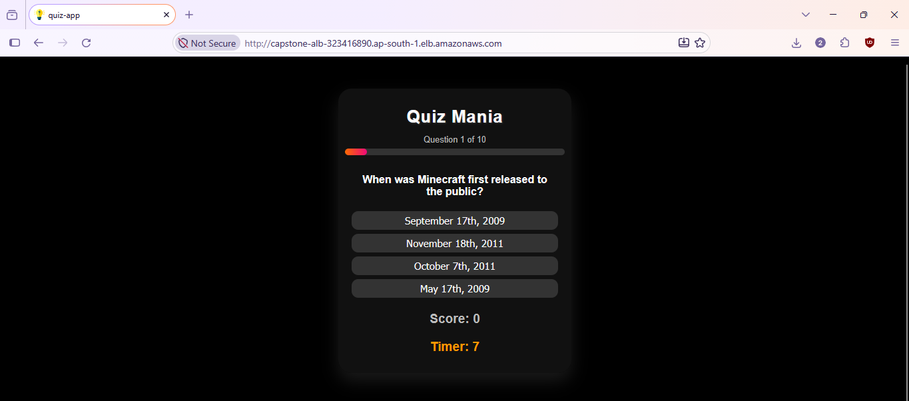

### DevOps services deployed by Ansible
SonarQube (port 9000) and Grafana (port 3000) are running as containers on the Managed EC2 after `ansible-playbook site.yml`.

| SonarQube | Grafana |
|---|---|
| 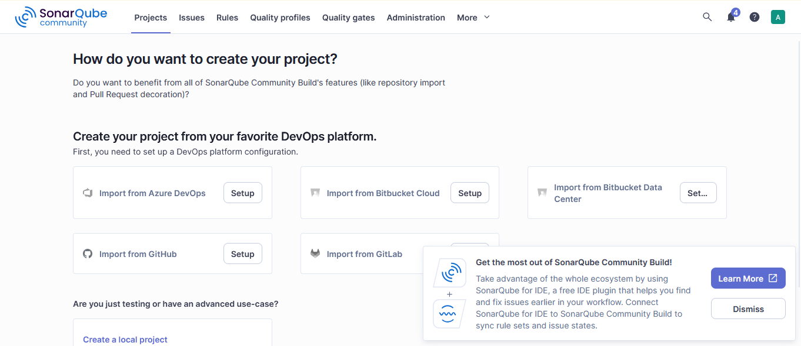 | 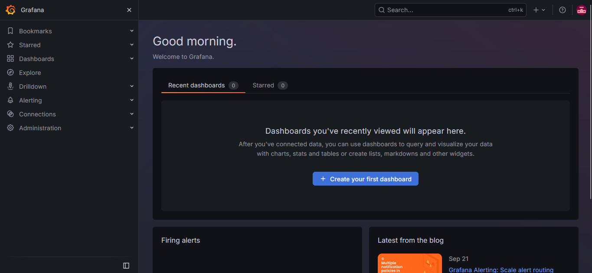 |

### Security gate and image publishing
Trivy reports zero HIGH/CRITICAL vulnerabilities, and the validated image lands in ECR.

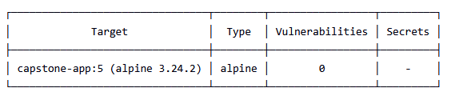
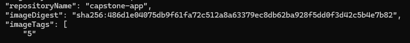

### Blue/Green traffic shift and rollback
Jenkins repoints the ALB listener to Green; a manual approval step reverses it to Blue.

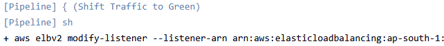
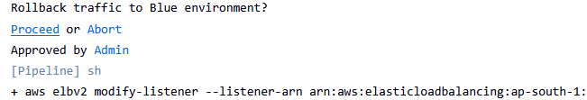

### Monitoring dashboards
Grafana reads ECS and ALB metrics from CloudWatch, with Blue and Green series shown side by side so you can see which service is taking traffic. The dashboard has six panels:

| ECS CPU Utilization | ECS Memory Utilization |
|---|---|
| 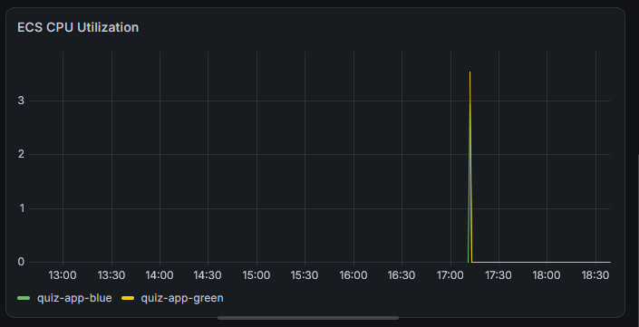 | 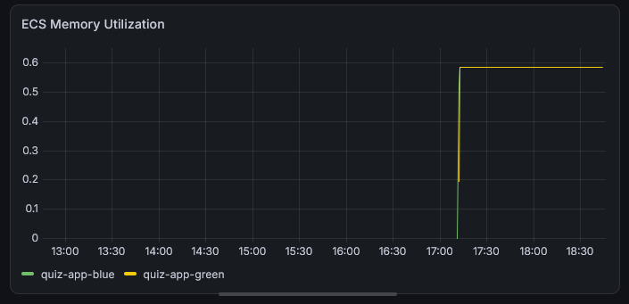 |

| ALB Request Count | ALB Target Response Time |
|---|---|
| 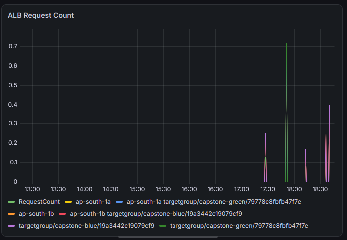 | 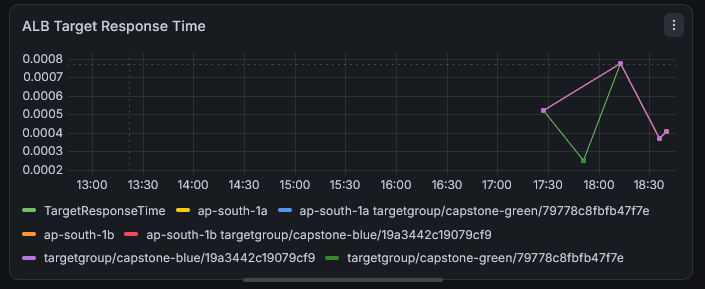 |

| Healthy Host Count | Unhealthy Host Count |
|---|---|
| 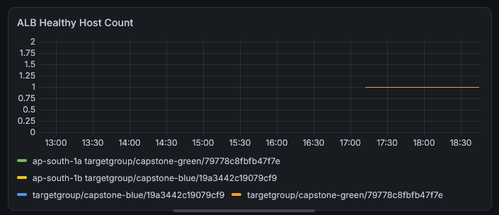 | 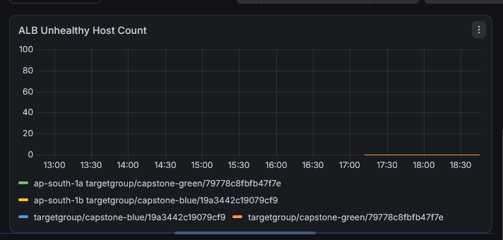 |

### Alert testing

**High ECS CPU (> 80%)**: a CPU stress test on the running task fires the alert; it returns to normal once the load stops.

| Firing | Recovered |
|---|---|
| 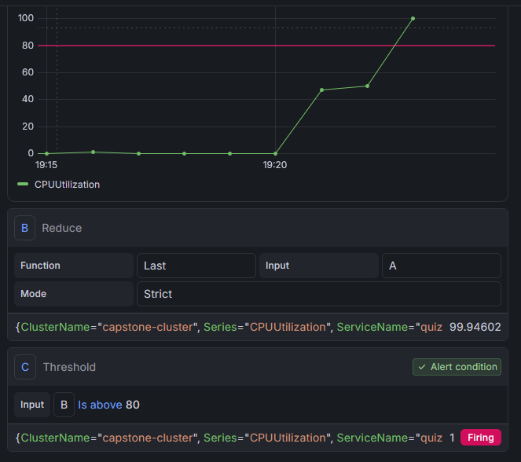 | 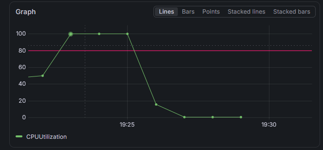 |

**Unhealthy ALB targets (> 0)**: an ECS target is made unavailable, then restored.

| Firing | Normal |
|---|---|
| 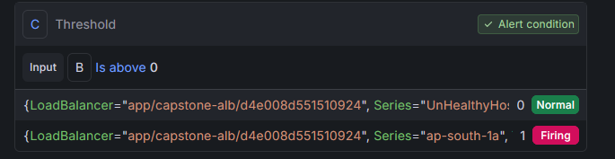 | 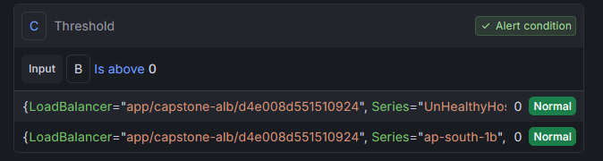 |

## Notes

- Control EC2 is a deliberate bootstrap exception; everything else is Terraform-managed.
- Blue/Green is implemented with two ECS services plus ALB listener switching, not CodeDeploy.

## Author

**Sreelakshmi T Raj**: [Quiz App source](https://github.com/SreelakshmiTRaj/Quiz-App)
